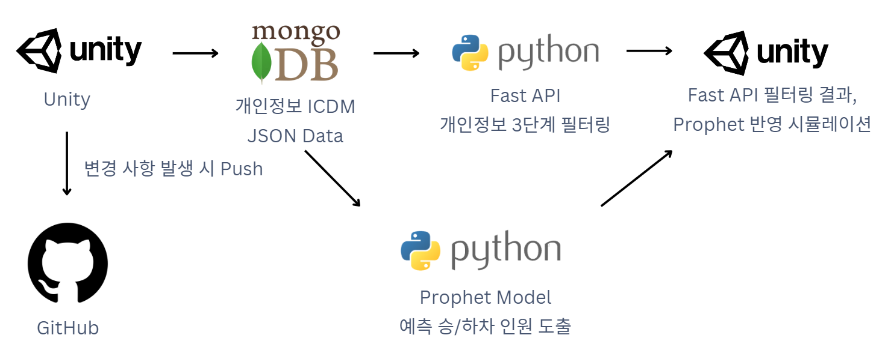

# PBL4-HEROS
# 개인정보 보호 3단계 필터링 시스템

## 📌 프로젝트 개요
디지털 트윈 기반으로 실시간 군중 밀집도를 분석하고 사고 가능성을 예측하여 안전 관리를 지원하는 시스템을 설계하였습니다. 이 과정에서 **개인정보 보호를 강화한 데이터 처리 방식**을 구현하였습니다.

## 시스템 구조도



## 주요 기능
- MongoDB에서 Python FastAPI를 통해 개인정보 3단계 필터링
- XGBoost 모델을 사용한 사고 확률 산출
- FastAPI를 통한 필터링 결과와 XGBoost를 사용한 예측 사고 확률을 Unity로 반환
---


## MongoDB 구조

### Cells

| Field             | Type               |
|-------------------|--------------------|
| datetime          | String             |
| cellID            | String             |
| population_size   | Integer            |
| age_distribution  | Embedded Object    |
| statistics        | Embedded Object    |
| event             | Embedded Object    |
| people[]          | Array of Embedded Objects |

#### Age Distribution (Embedded Object)

| age   | count |
|-------|-------|
| Integer | Integer |

#### Statistics (Embedded Object)

| average_age | Float |
|-------------|-------|
| median_age  | Float |

#### Event (Embedded Object)

| Field           | Type             |
|-----------------|------------------|
| name            | String           |
| event_date      | String (ISO 8601)|
| event_location  | String           |

#### People (Array of Embedded Objects)

| Field            | Type            |
|------------------|-----------------|
| peopleID         | String          |
| gender           | String          |
| age              | Integer         |
| movement_direction| Array of Float  |
| movement_speed   | Float           |
| location         | Object          |
| mobile_number    | String          |
| IMSI             | String          |

##### Location (Nested Object inside People)

| Field    | Type   |
|----------|--------|
| latitude | Float  |
| longitude| Float  |


## 🌟 3단계 개인정보 필터링
### **1단계 - 위기 대응 레벨**
- **목적**: 빠른 위기 대응을 위한 데이터 제공
- **특징**: 
  - 데이터 검열 없음

### **2단계 - 조건부 식별 레벨**
- **데이터 처리 방식**
  - 나이 정보는 정확한 숫자(`age`) 대신 그룹화된 연령대(`age_group`)로 변환
    - 예시: `age: 25` → `age_group: "mid_20s"`
    - **분류 기준**
      - `early_20s` (20~23세)
      - `mid_20s` (24~26세)
      - `late_20s` (27~29세)
  - 이동통신 데이터는 민감 정보 비식별화 처리
    - 전화번호: 뒤 4자리만 공개 (예: `010-****-5432`)
    - IMSI 정보: 완전히 삭제

### **3단계 - 군중 추세 레벨**
- **데이터 처리 방식**
  - 연령대 세분화를 통해 군중 데이터를 분석
    - 나이 정보는 청년(`youth`), 중년(`middle_aged`), 장년(`senior`), 노년(`elderly`)으로 구분
    - **분류 기준**
      - 청년: 10대 ~ 30대
      - 중년: 40대 ~ 50대
      - 장년: 60대
      - 노년: 70대 이상
  - 기존 숫자 기반 연령 분포(`age_distribution`)를 그룹화된 연령층 기반 분포로 변환
    - 예시
      ```json
      "age_distribution": {
        "youth": 2,
        "middle_aged": 1,
        "senior": 0,
        "elderly": 0
      }
      ```
  - 이동통신 데이터
    - 전화번호 및 IMSI 정보 완전 삭제

---

## ✅ 주요 성과
- **개인정보 비식별화 및 단계별 처리**로 안전성과 데이터 활용성의 균형 달성
- **민감 데이터 보호 기술**을 통해 군중 관리 데이터의 실질적인 활용 가능성 증대

---


## 🛠 기술 스택
- **개발**: Python, C#, MongoDB, Unity
- **협업도구**: Jira, GitHub, Notion
- **기타**: 개인정보 보호를 위한 비식별화 알고리즘, Privacy Protection, Anonymization, Digital Twin  

---


